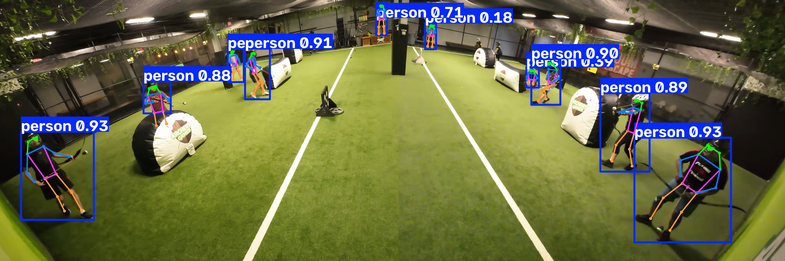
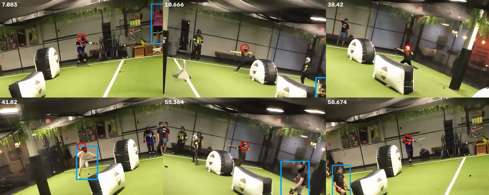
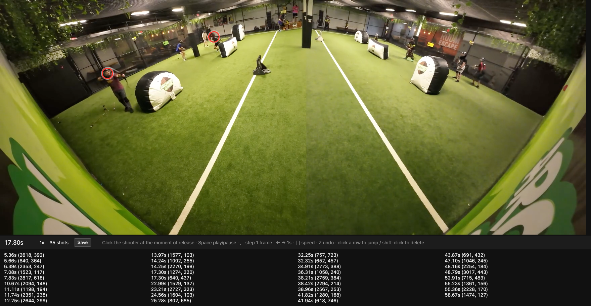
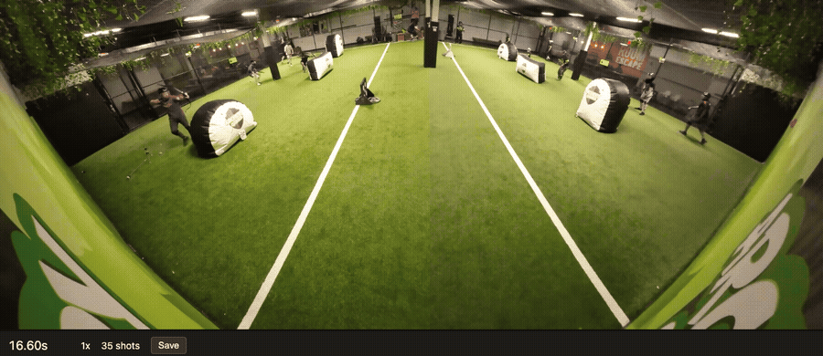
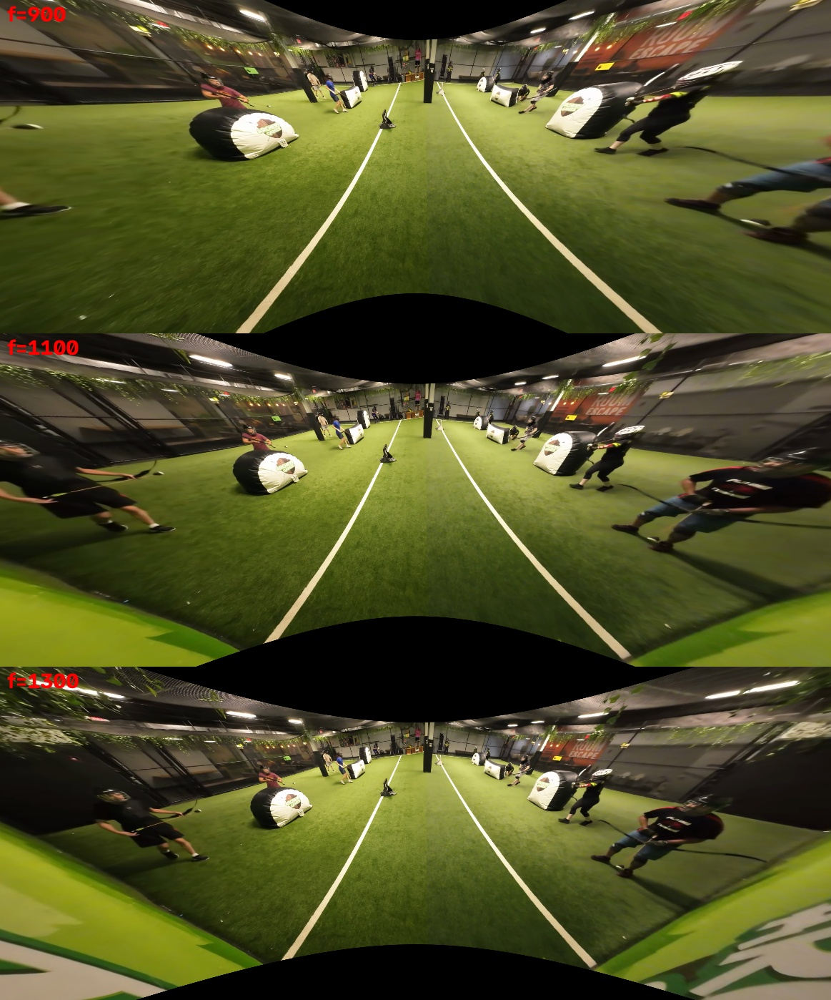

# archery-tag-stat-tracker

Automatically count per-player stats from Archery Tag league footage. The first stat is **shots taken per player**. Later stats are hits, times hit, and catches.

The input is the league's single fixed wide-angle camera: 3490×1400, 60 fps, mounted at one end of the neutral zone and looking down the field. Each team holds one half (left and right of the neutral zone).

## Status

_Last updated: 2026-10-08_

| Stage | State |
|---|---|
| Player detection + pose | ✅ Working. Field crop at high res, plus 2× zoomed tiles of the far end |
| Tracking | ⚠️ Works, but IDs fragment (one player becomes many track IDs) |
| Shot detection | ⚠️ About 54% of real shots found, about 54% of counted shots real (first minute, see [Results](#results)) |
| Who's who (player identity) | ⏳ Not started |
| Hits / catches | ⏳ Not started |

## Results

Ground truth: every shot in the first 60 s of the sample clip, hand-labeled with the [labeling page](#labeling-ground-truth). That's **35 shots** ([`data/labels_0-60s.json`](data/labels_0-60s.json)).

A detected shot counts as correct if it is within **±0.6 s** of a labeled release **and** the label click falls inside the shooter's box (grown by 30%). Each label can be matched to at most one detection.

| Version | Detector | Shot rule | Recall | Precision | Notes |
|---|---|---|---|---|---|
| v1 | field crop | "draw pose": one hand at the face, the other held out | 23% | 22% | Fails on near players seen from the front or back |
| v2 | field crop | "aim": both wrists at head height, then drop | 54% | 54% | Tuned on the same 35 labels, so optimistic |
| v3 | field crop + far-end tiles | "aim" | _running_ | _running_ | |

- **Recall:** the share of real shots that were found.
- **Precision:** the share of counted shots that were real.

## How it works

```
video ──► crop field + far tiles ──► YOLO11-pose ──► NMS merge ──► ByteTrack ──► per-track keypoints (.npz)
                                                                                          │
                     hand labels ◄── labeling page                                       ▼
                          │                                      shot rule (aim → release) ──► shots per track
                          └──────────────► evaluate / tune ◄─────────────────────────────┘
```

### 1. Detection and pose: [`track.py`](src/archery_tag_stat_tracker/track.py)

- Model: `yolo11s-pose` (17 COCO keypoints), run on Apple Silicon via MPS.
- **Field crop:** inference runs on `x 300–3300, y 0–1000` instead of the whole frame. Cutting out the ceiling and floor gives players more pixels at the same model input size (`imgsz=3008`).
- **Far-end tiles:** players at the far end are 70–100 px tall and were often missed mid-draw. The far strip (`y 0–500`) is also run as two overlapping tiles, each upscaled about 2×. This recovered 7 of the 10 missed far shooters (see below).
- The results are merged with NMS (IoU 0.5).

The test frame with the field crop at high resolution. Nearly every player is found:



Labeled shooters the field-crop-only detector missed. They're all at the far end and mid-draw:



### 2. Tracking

- [ByteTrack](https://github.com/ifzhang/ByteTrack), called directly on the merged detections.
- Lost tracks are kept for about 2 s, because players duck behind bunkers.
- Every second frame is processed (30 fps).
- **Known issue:** a 60 s clip yields over 100 track IDs for about 10 players. Fragments have to be re-joined into players before per-player counts mean anything.

### 3. Shot rule: [`shots.py`](src/archery_tag_stat_tracker/shots.py)

A shot is an **aim** that lasts at least 0.3 s and then ends. Aiming means both wrists are within 0.2 × box-height below the head. At release, the draw hand snaps away and the bow arm drops.

Why wrist height and not the textbook draw pose: near players are seen from the front or back. Their extended bow arm points almost straight at the lens, so in 2D it lands next to the draw hand. Only side-on (far) players show the arm extended. Wrist height works for both views.

Parameters were picked by grid search with [`tune.py`](src/archery_tag_stat_tracker/tune.py). With only 35 labels this overfits, so we need more labeled minutes before trusting the numbers.

### 4. Labeling ground truth: [`label.py`](src/archery_tag_stat_tracker/label.py)

A local web page for marking shots. Play the clip, pause at each release, and click the shooter. Labels autosave to `labels.json`. Keys:

- `Space` plays and pauses.
- `,` and `.` step one frame.
- `←` and `→` jump 1 s.
- `[` and `]` change speed.
- `Z` undoes the last label.





### 5. Evaluation and tuning: [`evaluate.py`](src/archery_tag_stat_tracker/evaluate.py), [`tune.py`](src/archery_tag_stat_tracker/tune.py)

See [Results](#results) for the matching criteria.

## Experiments

### Lens (fisheye) correction: not adopted for now

I tried OpenCV's fisheye undistortion (equidistant model, single focal length, no calibration target) at f = 900, 1100 and 1300:



Findings:
- People near the edges of the frame look more natural after correction. But those near players are already big and easy to detect.
- Correction **shrinks the center and far end**, which is where the detector struggles most. Far players would get fewer pixels unless the output were upscaled, and the far-end tiles already do that more cheaply.
- No single radial parameter straightens the field lines. The source is probably already a dewarped panoramic output, not a raw circular fisheye, so a proper fix needs line-based calibration using the field lines and posts.

**Decision:** don't warp the pixels for detection. Geometry correction will be useful later for mapping each player's foot point to **field coordinates**: team side, masking out spectators and refs, and player position heatmaps. That only needs a point mapping fitted to the field lines, not a full-image remap.

## Usage

```bash
uv sync
mkdir -p models && curl -sL -o models/yolo11s-pose.pt \
  https://github.com/ultralytics/assets/releases/download/v8.3.0/yolo11s-pose.pt

# 1. detect + track (≈10 min per video-minute on an M1 Pro)
uv run python -m archery_tag_stat_tracker.track data/sample_2min.mp4 --duration 60 --out out/tracks.npz

# 2. shots + overlay video
uv run python -m archery_tag_stat_tracker.shots out/tracks.npz --video data/sample_2min.mp4 --out out/overlay.mp4

# 3. score against labels / grid-search the rule
uv run python -m archery_tag_stat_tracker.evaluate out/tracks.npz data/labels_0-60s.json -v
uv run python -m archery_tag_stat_tracker.tune out/tracks.npz data/labels_0-60s.json

# label more footage (expects clip.mp4 in the folder; 1746×700 is fine)
uv run python -m archery_tag_stat_tracker.label out/label   # → http://127.0.0.1:8765/
```

`data/sample_2min.mp4` is the first 2 minutes of the full-resolution source ([YouTube](https://www.youtube.com/watch?v=va-S1pJyK5U)). Label coordinates are in source pixels (3490×1400).

## Roadmap

1. Re-run the evaluation with far-end tiles (v3).
2. Label 2–3 more minutes from other games, so tuning and testing use different data.
3. Mask out the area off the field: refs, spectators, and the far back wall.
4. Re-join track fragments into players using appearance and side, plus a quick naming step.
5. If the wrist-height rule plateaus, train a small classifier on keypoint sequences (or short player-crop clips), using the labels as training data.
6. Hits, times hit, and catches.
