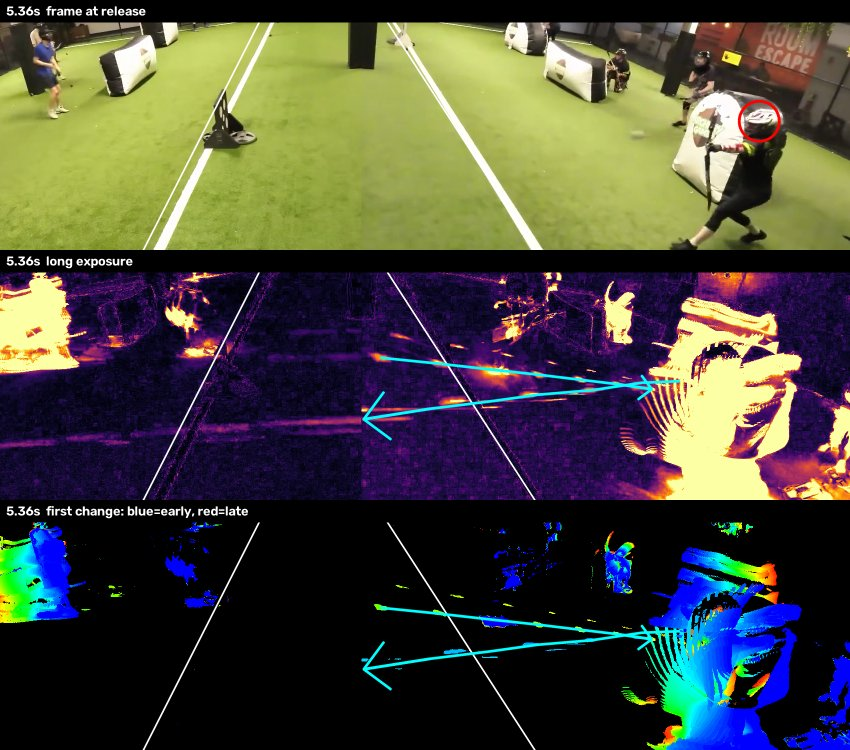
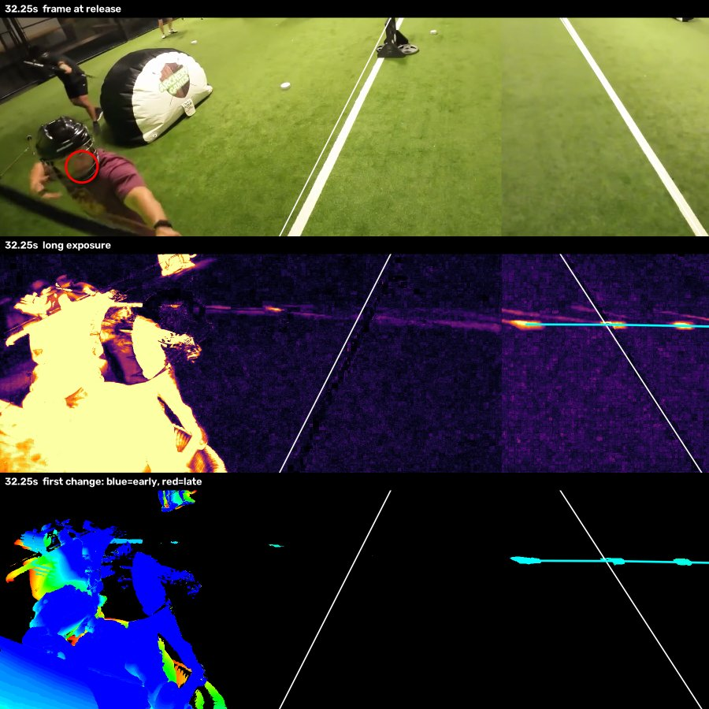
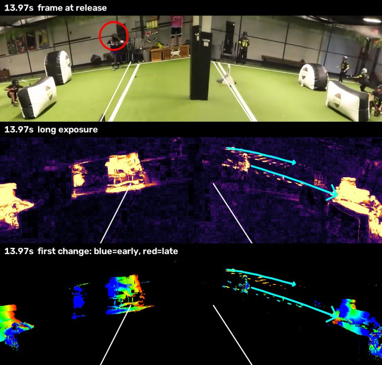
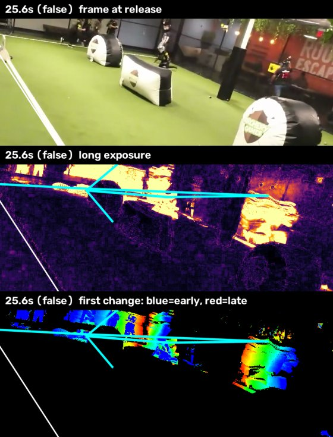
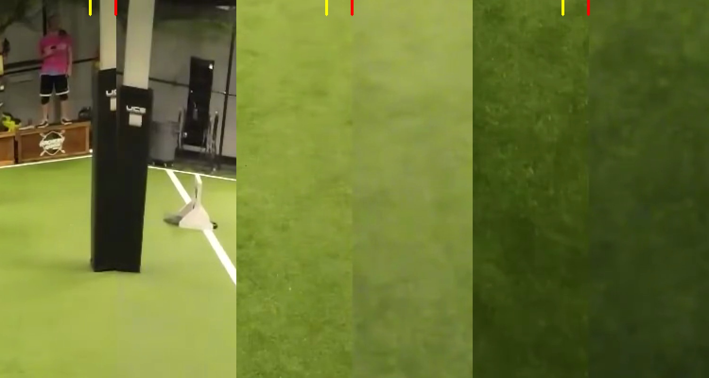
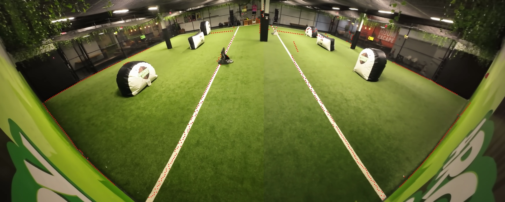
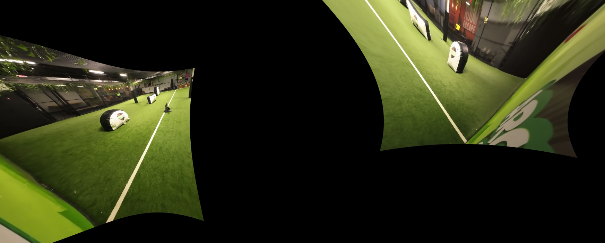

# archery-tag-stat-tracker

Automatically count per-player stats from Archery Tag league footage. The first stat is **shots taken per player**. Later stats are hits, times hit, and catches.

The input is the league's single fixed wide-angle camera: 3490×1400, 60 fps, mounted at one end of the neutral zone and looking down the field. Each team holds one half (left and right of the neutral zone).

## Status

_Last updated: 2026-10-08_

| Stage | State |
|---|---|
| Player detection + pose | ✅ Working. Field crop at high res, plus 2× zoomed tiles of the far end |
| Tracking | ⚠️ Works, but IDs fragment (one player becomes many track IDs) |
| Shot detection (pose) | ⚠️ 63% of real shots found, 44% of counted shots real (v3) |
| Shot detection (arrows) | ⚠️ 49% found, **68%** of counted shots real; 34% found / 86% real in a stricter setting (A4, see [Arrow detection](#arrow-detection-long-exposure)) |
| Shooter attribution from arrows | ⚠️ First try: even for real arrows, only about 55% get the right player at the right time. Straight-line tracing is bent by the fisheye |
| Lens correction | 🚧 Seam found (x = 1822, two GoPros). Calibrating from the scene alone isn't enough; blocked on camera info (see [Lens correction](#lens-fisheye-correction-in-progress-blocked-on-camera-info)) |
| Who's who (player identity) | ⏳ Not started |
| Hits / catches | ⏳ Not started |

## Results

Ground truth: every shot in the first 60 s of the sample clip, hand-labeled with the [labeling page](#labeling-ground-truth). That's **35 shots** ([`data/labels_0-60s.json`](data/labels_0-60s.json)).

A detected shot counts as correct if it is within **±0.6 s** of a labeled release **and** the label click falls inside the shooter's box (grown by 30%). Each label can be matched to at most one detection.

| Version | Detector | Shot rule | Recall | Precision | Notes |
|---|---|---|---|---|---|
| v1 | field crop | "draw pose": one hand at the face, the other held out | 23% | 22% | Fails on near players seen from the front or back |
| v2 | field crop | "aim": both wrists at head height, then drop | 54% | 54% | Tuned on the same 35 labels, so optimistic |
| v3 | field crop + far-end tiles | "aim" | **63%** | 44% | Labeled shooters with no detection drop from 8 to 4. But people per frame go from 7.4 to 13.8: the far tiles also pick up spectators and refs behind the field, which adds false shots |

| A1 | arrows: frame-by-frame linking | | 14% | 9% | The shooter's body movement stole the arrow's blobs |
| A2 | arrows: three-blob seeding + player masking | | 26% | 26% | "Must start outside the zone" threw away real arrows |
| A3 | arrows: speed in body-heights per frame + zone-crossing test | | 69% | 21% | Fake flights from players hidden behind the far-right bunker |
| A4 | arrows: A3 + at least 5 points + merge duplicates | | 49% | **68%** | Best F1 so far (0.57); tuned on the same labels |

Arrow rows (A1–A4) are scored on time and direction only: a flight must start between 0.05 s before and 0.6 s after a labeled release, and fly away from the shooter's half. They don't yet say *who* shot.

- **Recall:** the share of real shots that were found.
- **Precision:** the share of counted shots that were real.

## How it works

```
video ──► crop field + far tiles ──► YOLO11-pose ──► NMS merge ──► ByteTrack ──► per-track keypoints (.npz)
                                                                                          │
                     hand labels ◄── labeling page                                       ▼
                          │                                      shot rule (aim → release) ──► shots per track
                          └──────────────► evaluate / tune ◄─────────────────────────────┘
```

### 1. Detection and pose: [`track.py`](src/archery_tag_stat_tracker/track.py)

- Model: `yolo11s-pose` (17 COCO keypoints), run on Apple Silicon via MPS.
- **Field crop:** inference runs on `x 300–3300, y 0–1000` instead of the whole frame. Cutting out the ceiling and floor gives players more pixels at the same model input size (`imgsz=3008`).
- **Far-end tiles:** players at the far end are 70–100 px tall and were often missed mid-draw. The far strip (`y 0–500`) is also run as two overlapping tiles, each upscaled about 2×. In a spot check this recovered 6 of the 10 missed far shooters with confidence ≥ 0.29 (see below).
- The results are merged with NMS (IoU 0.5).

The test frame with the field crop at high resolution. Nearly every player is found:


Labeled shooters the field-crop-only detector missed. They're all at the far end and mid-draw:


### 2. Tracking

- [ByteTrack](https://github.com/ifzhang/ByteTrack), called directly on the merged detections.
- Lost tracks are kept for about 2 s, because players duck behind bunkers.
- Every second frame is processed (30 fps).
- **Known issue:** a 60 s clip yields over 100 track IDs for about 10 players. Fragments have to be re-joined into players before per-player counts mean anything.

### 3. Shot rule: [`shots.py`](src/archery_tag_stat_tracker/shots.py)

A shot is an **aim** that lasts at least 0.3 s and then ends. Aiming means both wrists are within 0.2 × box-height below the head. At release, the draw hand snaps away and the bow arm drops.

Why wrist height and not the textbook draw pose: near players are seen from the front or back. Their extended bow arm points almost straight at the lens, so in 2D it lands next to the draw hand. Only side-on (far) players show the arm extended. Wrist height works for both views.

Parameters were picked by grid search with [`tune.py`](src/archery_tag_stat_tracker/tune.py). With only 35 labels this overfits, so we need more labeled minutes before trusting the numbers.

### 4. Labeling ground truth: [`label.py`](src/archery_tag_stat_tracker/label.py)

A local web page for marking shots. Play the clip, pause at each release, and click the shooter. Labels autosave to `labels.json`. Keys:

- `Space` plays and pauses.
- `,` and `.` step one frame.
- `←` and `→` jump 1 s.
- `[` and `]` change speed.
- `Z` undoes the last label.


### 5. Evaluation and tuning: [`evaluate.py`](src/archery_tag_stat_tracker/evaluate.py), [`tune.py`](src/archery_tag_stat_tracker/tune.py)

See [Results](#results) for the matching criteria.

### 6. Arrow detection (long exposure): [`arrows.py`](src/archery_tag_stat_tracker/arrows.py)

**Why:** pose-based shot detection breaks when a shooter is crouched, behind a bunker, or seen from the front. But every shot has to fly across the **neutral zone**: plain turf, empty during play, and filmed by a fixed camera. So instead of watching the shooter, we watch the middle.

**The long-exposure idea:** stack a short window (about 0.8 s) of frames and keep, for each pixel, the largest change from the background. A flying arrow leaves a streak across the zone. At 60 fps the arrow moves 20–160 px per frame, so the streak is **dotted**, one blob per frame. Coloring each pixel by the frame it first changed in shows the direction of travel.

Each example below has three panels:
1. The frame at release, with the labeled shooter circled in red.
2. The long exposure.
3. The time-colored first-change map.

Cyan arrows are the flights the detector found. White lines are the neutral-zone edges.

**Mid-field, right → left (5.36 s).** The arrow crosses the whole zone in about 5 frames. A second flight (left → right) is the return shot labeled at 5.66 s.



**Near-left shooter, low and fast (32.25 s).** About 140 px per frame. The flight is only picked up right of the stitch seam (the brightness change mid-image). The part near the shooter is hidden by their own body.



**Far end (13.97 s).** Far arrows are small and slow on screen (20–55 px per frame), and the center pillar splits their flights. Speed is therefore measured in player-heights per frame, and flights count if their straight-line extension crosses the zone.



**Failure case: false flight (25.6 s).** Players crouched behind the far-right bunker aren't detected as people, so their moving limbs form straight, fast blob chains. This is the main remaining source of false shots.



**Pipeline:**
1. **Find fast-moving blobs.** In a band around the neutral zone, compare each frame with the frames 2 before and 2 after, and keep the pixels that differ from both. This leaves only fast movers.
2. **Mask out players.** Ignore blobs inside tracked player boxes.
3. **Start a flight only from a convincing triplet.** That means three blobs in consecutive frames that are evenly spaced, in a straight line, and fast (15–260 px per frame). Random clutter almost never forms one. The flight is then extended both ways, allowing 1 missed frame.
4. **Decide whether a flight is a shot.** It must have at least 5 points, move at least 0.25 player-heights per frame, fit a straight line (within 8 px or 15% of its speed), and have a straight-line path that crosses the neutral zone.
5. **Merge duplicates.** Merge flights going the same way within 0.15 s of each other. One arrow can split into several flights at the seam, at the pillar, or because of blur.

Runs at about 3× real time on an M1 Pro (18 s for 60 s of video).

**Experiment log (first minute, 35 labels):**

| Step | Change | Recall | Precision | What we learned |
|---|---|---|---|---|
| A1 | Frame-by-frame nearest-blob linking | 14% | 9% | Arrows move up to 160 px per frame, and the shooter's moving body steals their blobs |
| A2 | Start flights from 3-blob triplets; mask players; must start outside the zone and enter it | 26% | 26% | Clean arrows found. But arrows often *first appear* inside the zone (hidden by the shooter's body until then), so "starts outside" rejected them |
| A3 | Speed in player-heights per frame; straight-line extension must cross the zone | 69% | 21% | Far arrows recovered. False flights come from players hidden behind the far-right bunker (see the failure case) |
| A4 | At least 5 points; merge duplicates | 49% | 68% | Best balance. Setting the minimum to 6 points gives 34% / 86%: a high-precision signal |

**Crediting a shooter** ([`attribute.py`](src/archery_tag_stat_tracker/attribute.py)): fit a line through the flight and extend it back into the shooter's half. Then pick the tracked player whose shoulders are closest to that line, within 0.8 player-heights, in the 0.6 s before the arrow first appears. Scored strictly (right time **and** the label click inside that player's box):

| Arrow setting | Arrows found | Credited to the right player at the right time: recall / precision |
|---|---|---|
| ≥ 4 points | 63% / 27% | 29% / 16% |
| ≥ 5 points | 49% / 68% | 20% / 35% |
| ≥ 6 points | 34% / 86% | 17% / 55% |

Even when the arrow is real, it's credited to the wrong player about 45% of the time. A straight line extended over hundreds of fisheye-bent pixels drifts off the shooter. That's the motivation for [lens correction](#lens-fisheye-correction-in-progress-blocked-on-camera-info).

## Experiments

### Lens (fisheye) correction: in progress, blocked on camera info

**Why it matters:** crediting an arrow to its shooter means extending the flight's line back into the shooter's half. The fisheye bends straight flights into curves, so a long extension drifts off the true shooter. With each lens corrected, a straight 3D flight looks straight on screen (apart from the arrow's small drop), and tracing it back becomes reliable. Correction also enables a top-down court map.

**The setup:** the footage is **two GoPros** (one per half), stitched side by side. I first tried a single fisheye model for the whole frame. That can't work: no single setting straightens the field lines, because the frame contains two different lenses.


**Seam:** a hard cut at **x = 1822**, with no blending. It's the same at every height, which I found from a step in brightness and texture down that column across 30 frames. The far pillar visibly jumps at the seam because each camera sees it from a slightly different position. The left camera covers x 0–1822 and the right camera x 1822–3490.



**Calibrating without a checkerboard** ([`calib.py`](src/archery_tag_stat_tracker/calib.py)):
- Take the median of 60 frames to get an empty court.
- Mark rough seed points on features that are straight in reality: neutral-zone lines, far baselines, side-wall bases, and post edges.
- Snap each seed to the exact paint line or edge along its normal, to sub-pixel accuracy.
- Fit an OpenCV fisheye model so those features come out straight.



| Attempt | Model | Result |
|---|---|---|
| C1 | per half: f, cx, cy, k1, k2; residual = distance off the fitted line in undistorted coordinates ÷ line length | Fake success (right-half error went to 0). Stretching points toward the edge of the lens makes the lines "long", which shrinks the error |
| C2 | Same, but the residual is each viewing ray's angle off a great circle (a straight 3D line seen from the camera lies in a plane through the camera) | Fake success again: a huge f squeezes all rays together |
| C3 | C2 ÷ the line's angular span; bounds for a GoPro-like 100–130° field of view | The lens centers drift far off-center and the corrected halves are clearly warped (below) |
| C4 | Shared f, k1, k2 for both cameras; lens centers fixed at the middle of each half; curved padding edges removed | The fit runs into its bounds and barely helps (error 0.026 → 0.024). The halves don't behave like centered GoPro frames, probably because the stitcher cropped each camera off-center |



**Where this stands:** a handful of floor lines and posts aren't enough to pin down an off-center, cropped fisheye. One of these would unblock it:
1. The GoPro model and lens mode (Wide, SuperView or Linear). Known lens profiles would fix the distortion terms, and only the crop offset would need fitting.
2. The raw per-camera files. No crop, a known lens center, and better quality than the YouTube upload.
3. A 20-second clip of a checkerboard (printed or on a tablet) waved in front of each mounted camera. Only worth it if the cameras are mounted in the same place each week.

**Plan once calibrated:** undistort only the points we need (arrow blobs, keypoints, boxes) for geometry, which is instant and doesn't touch detection. Then build a re-stitched corrected view, cylindrical rather than flat, since together the two cameras cover nearly 180°. Then a top-down court map.

**Earlier finding that still holds:** warping whole frames for *detection* probably won't help. It shrinks the far end, which is exactly where the detector struggles.

## Usage

```bash
uv sync
mkdir -p models && curl -sL -o models/yolo11s-pose.pt \
  https://github.com/ultralytics/assets/releases/download/v8.3.0/yolo11s-pose.pt

# 1. detect + track (≈10 min per video-minute on an M1 Pro)
uv run python -m archery_tag_stat_tracker.track data/sample_2min.mp4 --duration 60 --out out/tracks.npz

# 2. shots + overlay video
uv run python -m archery_tag_stat_tracker.shots out/tracks.npz --video data/sample_2min.mp4 --out out/overlay.mp4

# 3. score against labels / grid-search the rule
uv run python -m archery_tag_stat_tracker.evaluate out/tracks.npz data/labels_0-60s.json -v
uv run python -m archery_tag_stat_tracker.tune out/tracks.npz data/labels_0-60s.json

# arrows in flight (uses tracks to mask out players) + long-exposure images
uv run python -m archery_tag_stat_tracker.arrows data/sample_2min.mp4 --duration 60 --tracks out/tracks.npz --out out/arrows.json
uv run python -m archery_tag_stat_tracker.longexposure data/sample_2min.mp4 5.36 --crop 1100,150,2800,650 \
  --arrows out/arrows.json --labels data/labels_0-60s.json --out out/le_536.jpg

# label more footage (expects clip.mp4 in the folder; 1746×700 is fine)
uv run python -m archery_tag_stat_tracker.label out/label   # → http://127.0.0.1:8765/
```

`data/sample_2min.mp4` is the first 2 minutes of the full-resolution source ([YouTube](https://www.youtube.com/watch?v=va-S1pJyK5U)). Label coordinates are in source pixels (3490×1400).

## Roadmap

1. **Next:** credit each arrow flight to a shooter: trace it back, then choose among nearby players using timing and pose. Score *who shot* against the labels.
2. Fix false arrow flights from players hidden behind bunkers (for example, ignore blob chains that start and end inside a player's half without reaching the zone).
3. Mask out the area off the field. The far tiles roughly doubled the number of people detected, many of them spectators and refs.
4. Label 2–3 more minutes from other games, so tuning and testing use different data.
5. Re-join track fragments into players using appearance and side, plus a quick naming step.
6. If the wrist-height rule plateaus, train a small classifier on keypoint sequences (or short player-crop clips), using the labels as training data.
7. Hits, times hit, and catches (the arrow flights are the starting point).
