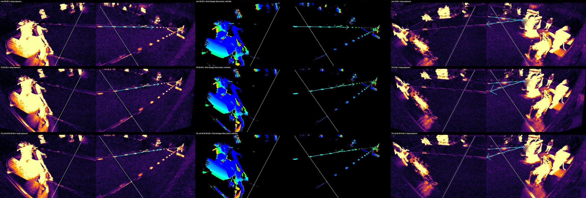

# Report: which lens correction gives the cleanest arrow flights?

_2026-10-08 · first 60 s of `data/sample_2min.mp4` · 35 hand-labeled shots_

## Question

Does correcting the lens make arrow flights straighter (or cleaner gravity arcs), and does that help us trace each arrow back to its shooter?

## Setup

Five correction variants, plus one control. Each one was rendered as a 1-minute video:

| Variant | What it is |
|---|---|
| `raw` | The stitched frame, no correction |
| `raw_resampled` | **Control.** The raw frame shifted by half a pixel. It softens the image exactly like a correction does, but changes no geometry |
| `T4` | Current correction: k1 +0.2 with lens centers on the seam, far-baseline alignment, pillar warp |
| `T4_k2-0.08`, `T4_k2-0.15` | T4 plus a 4th-order term that straightens the near-side periphery (near walls) |
| `T4_k1+0.3` | T4 with a stronger main lens term |

For every variant, player tracks, labels and the neutral-zone outline were converted into that variant's coordinates. The arrow detector then ran on the corrected frames **with identical settings**. Every variant starts from the same decoded source frames (corrected on the fly, never re-encoded), so the only difference is the correction itself. Code: [`variants.py`](../src/archery_tag_stat_tracker/variants.py).

## Results

### 1. Detection: resampling costs about 25% of arrows; the geometry costs nothing

| Variant | Real shots found (≥5 points) | Counted shots that were real | Strict (≥6 points): found / real |
|---|---|---|---|
| raw | **19 / 35** | 66% | 13 / 76% |
| raw_resampled (control) | 14 / 35 | 56% | — |
| T4 | 14 / 35 | 67% | 10 / **91%** |
| T4_k2-0.08 | 14 / 35 | 61% | 10 / 91% |
| T4_k2-0.15 | 15 / 35 | 54% | 11 / 92% |
| T4_k1+0.3 | 14 / 35 | 58% | 9 / 75% |

Every correction finds 14–15 shots. The **control finds 14 too**, with zero change to the geometry. So the drop from 19 is caused by **pixel resampling**: interpolation softens thin, fast arrow streaks below the detector's change threshold. The correction geometry itself costs nothing.

### 2. Flight shape: T4 gives the cleanest gravity arcs

These are paired results: the same 15 labeled shots, detected in every variant. Bend is scaled by flight length (‰), because each correction rescales the image.

| Variant | Off a straight line (‰ of length) | Off a gravity arc (‰ of length) | Median length |
|---|---|---|---|
| raw | 7.8 | 2.5 | 379 px |
| raw_resampled (control) | 5.4 | 2.5 | 378 px |
| **T4** | 5.7 | **1.6** | **450 px** |
| T4_k2-0.08 | 6.4 | 3.1 | 397 px |
| T4_k2-0.15 | 5.4 | 2.3 | 394 px |
| T4_k1+0.3 | 5.9 | 2.5 | 402 px |

- **Arc fit:** T4's flights fit a parabola (a gravity arc) about **35% better** than any other variant, the control included.
- **Length:** the linker strings T4 flights into longer chains, +19% px, or about +10% after allowing for T4's ~8% zoom.
- **Straight-line fit:** this barely separates the variants. Real flights do arc, and blob-center noise from resampling is about the same size as the differences.



_Rows: raw, T4, T4_k2-0.15. Columns:_
- _32.25 s long exposure: a near-left shot, plus a return shot from the right_
- _the same shot colored by time: blue = early, red = late_
- _5.36 s long exposure: mid-field, both directions_

_The cyan arrows are the detected flights. In raw, the near-left arrow's trail steps where it crosses the seam. In T4 the left and right parts line up._

### 3. Shooter attribution: no reliable difference yet

| Pipeline | Right shooter at the right time (≥6 points): recall / precision |
|---|---|
| Detect on raw | 17% / 40% |
| Detect on corrected frames: T4 / k2−0.08 / k2−0.15 / k1+0.3 | 14% / 45%, 17% / 55%, 23% / 67%, 17% / 50% |
| Detect on raw, trace back in corrected coordinates: T4 / k2−0.15 | 17% / 38%, 14% / 31% |

The differences are 1–3 shots out of 35, and they flip between runs. An earlier run favored T4 at 26% / 64%. Shooter attribution can't separate the variants until we have more labels.

## Verdict: T4 is the best correction, but detection should run on the original pixels

**Why T4 wins:**
1. **Cleanest arcs.** On the same 15 arrows, T4 flights fit a gravity arc with the least error (1.6‰ vs 2.3–3.1‰), and they link into the longest chains. Clean arcs and long chains are what tracing back to a shooter needs.
2. **It corrects where flights actually happen.** Every flight is measured in and around the neutral zone, near the top-center of the frame. That's exactly where T4 was tuned: the radial term centered on the seam at the far-baseline height, the baseline alignment, and the pillar seam warp.
   - The two GoPro halves now agree across the seam, so a flight crossing it continues on one line instead of stepping.
   - That makes the projected 3-D arc a smooth curve again.
3. **The k2 variants fix the wrong region.** They straighten the near-side periphery (the walls), where flights are rarely measured, and in doing so they slightly bend the central region (arc error 2.3–3.1‰). `k1+0.3` over-corrects the center.

**But don't detect on corrected frames.** Resampling loses about a quarter of the arrows (19 → 14 found). The recommended pipeline:
- detect arrows on the **original** frames,
- convert flight points and player positions into **T4** coordinates with `Lens.points()`, which involves no resampling,
- use the corrected video only for viewing.

## Next

1. **Label more shots** (60–120 s with the yes/no review tool) so shooter-attribution differences become measurable.
2. **Detection on near-side arrows** is still the weakest area. Long exposures show clear near-side trails that never get linked: they're masked by the shooter's own box, and they move up to ~250 px/frame. Fixing that will add the near-side flights this comparison couldn't include.
3. **If detection on corrected frames is ever needed,** try sharper interpolation (cubic or Lanczos) and re-run the `raw_resampled` control.

## Reproduce

```bash
uv run python -m archery_tag_stat_tracker.variants data/stitch/va-S1pJyK5U.json out/tracks_v2.npz data/labels_0-60s.json
# videos: out/variants/<variant>/video.mp4 · results: out/variants/results.json
```
